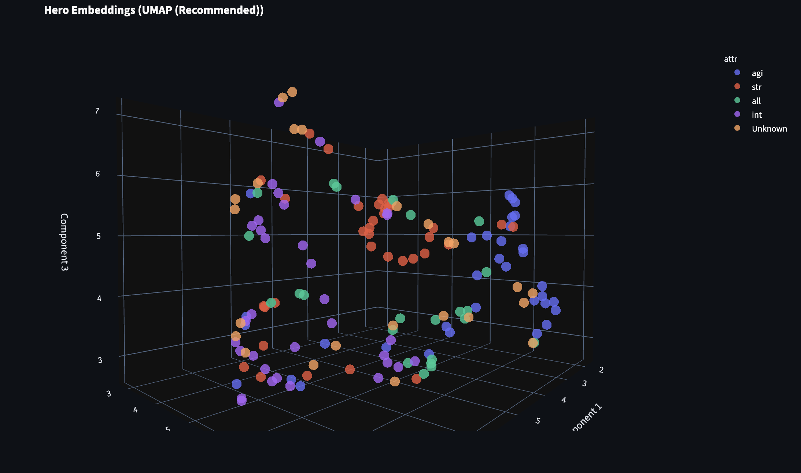

# Dota 2 Drafting Model (AlphaZero Style)

A deep learning system that learns the "Energy Landscape" of Dota 2 drafting. It moves beyond simple imitation learning by building a comprehensive World Model of the game's drafting phase, capable of understanding roles, lane dynamics, and win conditions.

## Data Source

The model is trained on high-level professional matches fetched from the **OpenDota API**.
*   **Input:** Captain's Mode draft sequences (Picks & Bans).
*   **Rich Features:**
    *   Hero IDs and Draft Order.
    *   Player Roles (1-5) derived from in-game lane presence and farm.
    *   Lane Outcomes (Gold Difference at 10 minutes).
    *   Match Winner.

## The World Model

The core of the system is a **Multi-Task Transformer** that maps the complex interactions of heroes into a high-dimensional vector space. This is so that it doesn't just memorize picks; it learns the underlying mechanics of the draft by building some form of a world model (Hamiltonian/Energy Landscape):

1.  **Policy Head (The Prior):** Predicts the most likely next move based on professional trends.
2.  **Value Head (The Evaluator):** Estimates the win probability of any given draft state.
3.  **Role Head (The Context):** Explicitly predicts which hero is playing which role (Carry, Mid, Offlane, Support), giving the model a structural understanding of the lineup.
4.  **Synergy Head (The Mechanics):** Predicts the **Gold Difference** at 10 minutes for each lane.
    *   *Architecture:* Fuses the Draft Representation with the Predicted Roles to calculate precise, role-aware lane matchups.

## MCTS: Charting the Probability Space (Implemented)

While the World Model captures the static rules and correlations of the game, **Monte Carlo Tree Search (MCTS)** captures the dynamic consequences (The path integral within the Hamiltonian that optimizes for winning).

*   **Adversarial Search:** Instead of assuming a cooperative environment, MCTS simulates the opponent's best responses (Minimax).
*   **Probability Charting:** It explores the branching future of the draft, using the Policy Head to guide exploration and the Value Head to evaluate leaf nodes.
*   **Result:** It finds the "Path of Least Resistance" to victory, effectively solving for the Nash Equilibrium of the draft rather than just copying human biases.

## Performance

*   **Top-5 Accuracy:** ~40% (Predicting human pro picks).
*   **Top-1 Accuracy:** ~16%.
*   **Loss:** Converged to ~4.5 (Multi-task weighted loss).

*Note: Accuracy is limited by the "Aleatoric Uncertainty" of drafting—there are often many valid picks in any given situation.*

## Training Curves


## Model Internals: Embedding Visualization

The model learns a **128-dimensional embedding space** for all Dota 2 heroes. Using UMAP dimensionality reduction, we can visualize how the model internally represents hero relationships:



### What This Shows

**Key Observations:**
- **Emergent Clustering by Attribute**: The model naturally groups heroes by their primary attribute (Strength/Agility/Intelligence) **without being explicitly told about attributes**. This clustering emerges purely from learning draft patterns, synergies, and win conditions.
- **Semantic Proximity**: Heroes close together in this space are considered "similar" by the model - they get picked in similar contexts, work well together, or fill similar roles.
- **Role Understanding**: The spatial organization suggests the model has learned meaningful abstractions about hero archetypes (carries cluster near each other, supports form their own region, etc.).

This visualization proves the model isn't just memorizing picks - it's learning the underlying structure of the game. One very interesting phenomena is that since the model is trained to predict drafts, you can see that the clustering has placed most heroes of similar attributes together, there are exceptions, and these are the heroes that might be a different attribute, but in play they behave functionally similar to the attribute they are grouped up with (which is a Dota peculiarity), for example, in the cluster of agility heroes, we can spot both Sven and Lifestealer, and it makes sense, because these are both played as carries!

## Features

### Interactive Visualization App (`app.py`)
A Streamlit web app to explore the model's learned embeddings in 3D.

**Features:**
- **3D Scatter Plot**: Rotate and zoom to explore the hero embedding space
- **Algorithm Selection**: Switch between UMAP (local clusters) and PCA (global structure)
- **Attribute Coloring**: Heroes colored by primary attribute (Str/Agi/Int)
- **Interactive Tooltips**: Hover over any hero to see its name and roles

**Launch the app:**
```bash
streamlit run app.py
```

Then navigate to `http://localhost:8501` in your browser.

### 🎮 Interactive Draft Assistant (`play.py`)
A CLI tool to draft against the AI or use it as a companion.
*   **Real-time Suggestions:** Top 5 recommended picks/bans.
*   **Win Rate Estimation:** Live update of your winning chances.
*   **Lane Forecasting:** Predicts specific gold advantages/disadvantages for Safe, Mid, and Off lanes based on the current lineup.

## 🛠️ Setup & Usage

### Prerequisites
```bash
pip install -r requirements.txt
```

If you want to use the visualization app, also install:
```bash
pip install streamlit plotly umap-learn
```

### Training Pipeline

1.  **Collect Data:**
    ```bash
    python scripts/01_collect_data.py
    ```

2.  **Process Data:**
    ```bash
    python scripts/02_process_data.py
    ```

3.  **Train:**
    ```bash
    python scripts/03_train.py
    ```

### Usage

**Draft Assistant (CLI):**
```bash
python play.py
```

**Embedding Visualization (Web App):**
```bash
streamlit run app.py
```

**Standalone Visualization (Generates HTML):**
```bash
python scripts/visualize_embeddings_standalone.py --algo umap
# or
python scripts/visualize_embeddings_standalone.py --algo pca
# Opens embedding_visualization.html in your browser
```
